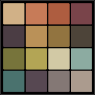

#  Tesseŀla - A Pixel Art Camera

Tesseŀla is a progressive web app that transforms your device's camera feed into pixel art in real-time. It uses color quantization and dithering to create retro-style images with a variety of built-in and custom color palettes.

> _Tesseŀla_ comes from the Catalan word for _tessera_, the small, individual tile used in creating a mosaic. Just as ancient mosaics used thousands of tesserae to form a larger image, this app uses pixels as digital tiles to create a piece of art from the camera's view.

## Features

-   **Real-Time Pixelation**: See the world as pixel art directly through your camera.
-   **Image Upload**: Process existing photos from your device's gallery.
-   **Rich Palette Library**: Comes with 30+ curated palettes from [LOSPEC](https://lospec.com/palette-list).
-   **Custom Palettes**: Upload your own color palettes (32xM or Mx32 pixel image format) to create your unique look.
-   **Dithering Control**: Toggle blue noise dithering for smoother gradients.
-   **Resolution Toggle**: Switch between two different pixelation levels.
-   **Save & Share**: Long-press a captured image to save it to your device or share it, complete with an attached palette strip.
-   **PWA Ready**: Install it on your home screen for a native app-like and cached for offline use experience.

## How to Use

### Basic Controls
-   **Shutter Button (Red, Center)**: Tap to freeze the camera feed. Tap again to return to the live view.
-   **Palette Bar (Top)**: Tap to cycle through the available color palettes.
-   **Resolution Button (Square Icon)**: Toggles between low and ultra-low resolution.
-   **Dither Button (Eye Icon)**: Enables or disables the dithering effect.
-   **Upload Button (Upload Icon)**: Opens a file picker to process a local image or upload a new palette.
-   **Flip Camera Button (Face Icon)**: Switches between your device's front and rear cameras.

### Advanced Actions
-   **Open Palette Library**: **Long press** the top palette bar to open a modal showing all available palettes for quick selection.
-   **Save or Share Image**: After tapping the shutter to freeze the frame, **long press** anywhere on the image. This will bring up your device's native share sheet, allowing you to save the image or send it to another app.
-   **Upload a Custom Palette**: Create a 32xM or Mx32 pixel PNG file where each 32x32 square is a solid color of your palette. Use the **Upload button** to load it. The app will automatically parse it, save it, and make it available in your palette list.

---

---

## Credits

-   **Palettes**: Sourced from the fantastic collection at [LOSPEC](https://lospec.com/palette-list). You can see the full list with links to each in Lospec in [here](https://www.mostlymaths.net/tessella/palettes.html)
-   **Libraries**: Built with [interact.js](https://interactjs.io/) for gestures and [idb-keyval](https://github.com/jakearchibald/idb-keyval/) for storage.
-   **Fonts**: Uses [Inter](https://fonts.google.com/specimen/Inter) and [Jersey 10](https://fonts.google.com/specimen/Jersey+10).
-   **Icons**: Provided by [Iconoir](https://iconoir.com/).
